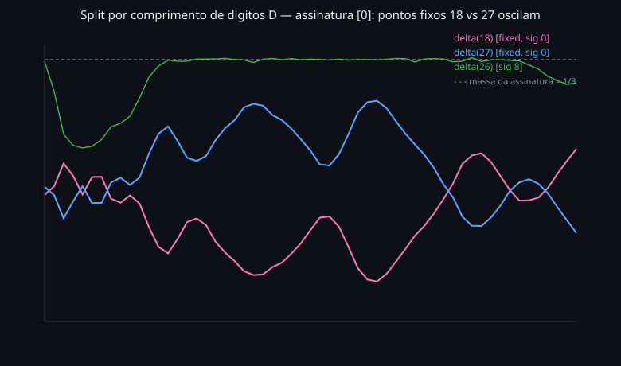
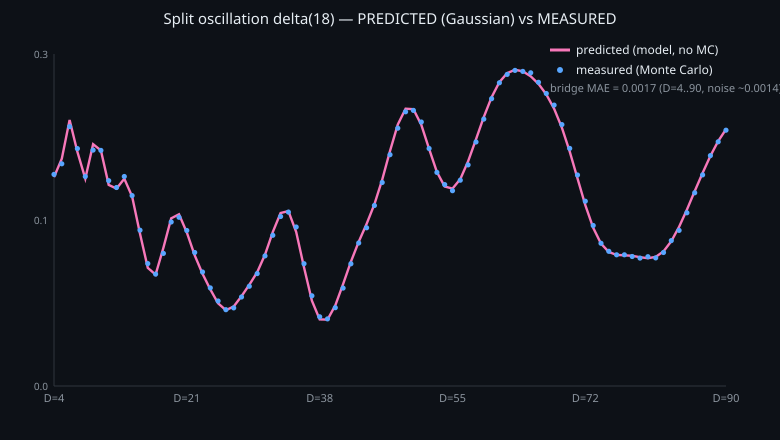

# Mapas Iterados de Soma de Dígitos de Potências: um Teorema de Cota Inferior, uma Lei Exata de Densidade de Bacias e a Oscilação da Divisão Intra-Assinatura

**Alex Martins**

*Pesquisa Independente, Agosto de 2026 (v2.1.0; patch empírico Tier B, setembro de 2026; ver Apêndice B)* ·
[Zenodo](https://zenodo.org/records/22181953) · [10.5281/zenodo.22181953](https://doi.org/10.5281/zenodo.22181953)

**MSC 2020:** 37P35, 11A63, 11K06, 11A25, 05C20
**Palavras-chave:** sistemas dinâmicos discretos, funções soma de dígitos, números felizes generalizados, aritmética modular, bacias de atração, densidade natural, equidistribuição, grafos funcionais, funções digitais.

---

## Resumo

O presente trabalho estuda a família de sistemas dinâmicos discretos $f_{k,b}(n) = S_b(n^k)$, em que $S_b$ é a função soma dos dígitos em base $b$ e $k \ge 1$ é um expoente fixo. O mapa relaciona-se com, mas distingue-se das, funções felizes generalizadas $S_{e,b}(n) = \sum_i d_i^{\,e}$ de Grundman e Teeple; a distinção, e a estrutura modular que dela se segue, é precisada na §1. Toda órbita é eventualmente periódica, e o sistema organiza-se por um esqueleto algébrico: o grafo funcional do mapa de potência modular $\varphi_{k,b-1}(x) = x^k \bmod (b-1)$.

Três resultados estruturais são demonstrados. **(I) Teorema da Cota Inferior.** O número de atratores satisfaz $|C(k,b)| \ge \mathrm{Cyc}(\varphi_{k,b-1})$, o número de ciclos do mapa modular. **(II) Lei de Densidade de Bacias.** Para cada ciclo modular $\gamma_i$ com bacia de resíduos $R_i$, a bacia agregada $\mathcal{N}_i$ de todos os atratores que carregam a assinatura de resíduos $\gamma_i$ possui densidade natural, igual exatamente ao peso modular $p_i = |R_i|/(b-1)$; sobre uma janela $[1,M]$ a proporção empírica desvia no máximo $\min(|R_i|,\,b-2)/M$, e a afirmação subjacente em janela finita é uma identidade exata entre inteiros. **(III)** Ambas as funções de contagem de $\varphi_{k,m}$ admitem formas fechadas: a contagem de pontos periódicos é a clássica $\prod_{p^e \| m}\big(1 + \kappa_k(\varphi(p^e))\big)$, com $\kappa_k(N)$ o maior divisor de $N$ coprimo com $k$, enquanto a contagem de ciclos (a quantidade de que a cota inferior precisa) obtém-se combinando tipos de ciclo locais pelo teorema chinês dos restos. A distinção importa e passou despercebida em um rascunho anterior: a contagem de pontos periódicos depende de $k$ apenas via $\mathrm{rad}(k)$, ao passo que a contagem de ciclos não.

Os resultados (I) e (II) são consequências elementares da congruência da soma de dígitos (a "prova dos noves") e da equidistribuição de resíduos. A novidade do presente trabalho reside na organização dessas consequências e no isolamento do problema restante: como a massa $p_i$ se divide entre vários atratores físicos que compartilham uma assinatura. Essa partição não é elementar. Ela é resolvida aqui empírica e mecanicamente. As densidades de bacia individuais não parecem existir; ao longo de comprimento de dígitos fixo elas oscilam quase-periodicamente, em antifase entre atratores competidores, sempre somando $p_i$. Um modelo sem parâmetros, a lei gaussiana de $S_b(n^k)$ (teorema do limite local) na rede de imagem $v \equiv r^k \pmod{b-1}$, convoluída com a rotulação exata inteiro-para-atrator, reproduz a oscilação dentro do ruído de Monte Carlo (erro médio de ponte $|δ_j-F_j| \approx 0{,}0017$ no piloto $(3,10)$ em $D=4\ldots 90$; `scripts/bridge_check.py`). A oscilação é uma instância da clássica flutuação log-periódica de funções digitais (Delange; Drmota–Grabner).

Todas as afirmações são verificadas computacionalmente: uma varredura exaustiva de 19.500 pares de parâmetros $(k,b)$ com $k \le 500$, $b \le 40$, com zero violações da cota inferior e com a forma inteira exata da lei agregada valendo sem exceção, acrescida de uma reimplementação independente relatada no Apêndice A.

*Errata.* Esta versão corrige cinco erros do rascunho de julho de 2026: uma afirmação falsa sobre a contagem de ciclos modulares, uma classificação errada de quais assinaturas oscilam, uma alegação exagerada de estreiteza para a cota de erro, uma estatística confundida, e uma rede de congruência errada no modelo gaussiano da divisão. Cada um está documentado no Apêndice B, junto com o raciocínio que o produziu, pois os modos de falha são instrutivos.

---

## 1. Introdução

### 1.1 O mapa, e como ele difere das funções felizes

Fixe uma base $b \ge 2$ e ponha $m = b-1$. A **função feliz generalizada** estudada por Grundman e Teeple [2,3] e revista em [6] é

$$S_{e,b}(n) \;=\; \sum_i d_i^{\,e}, \qquad n = \sum_i d_i\, b^i,$$

a soma das $e$-ésimas potências dos *dígitos* de $n$ em base $b$. O objeto do presente trabalho é o mapa diferente

$$f_{k,b}(n) \;=\; S_b\big(n^k\big),$$

a **soma dos dígitos de $n^k$** em base $b$. Esses são sistemas dinâmicos distintos. Para $(k,b) = (2,10)$, o mapa feliz envia $13 \mapsto 1^2+3^2 = 10 \mapsto 1$ (logo 13 é feliz), ao passo que $f_{2,10}(13) = S_{10}(169) = 16$ e $f_{2,10}(16) = S_{10}(256) = 13$: um $2$-ciclo. A iteração clássica dos números felizes e $f_{2,10}$ não são o mesmo sistema.

O que as duas famílias compartilham é a aritmética que dirige tudo o que segue: a congruência clássica

$$S_b(N) \equiv N \pmod{m}, \qquad m = b-1, \tag{CO9}$$

(a "prova dos noves"), válida para todo $N$, pois $b \equiv 1 \pmod{m}$ implica $d_i b^i \equiv d_i \pmod m$ dígito a dígito. Para $f_{k,b}$ isso produz a identidade

$$f_{k,b}(n) \;=\; S_b(n^k) \;\equiv\; n^k \pmod{m}, \tag{1}$$

de modo que reduzir a dinâmica mod $m$ fornece exatamente o mapa de potência modular $\varphi_{k,m}(x) = x^k \bmod m$. (Para o mapa feliz $S_{e,b}$ a redução mod $m$ é $\sum_i d_i^{\,e}$, que não é função apenas de $n \bmod m$; esta é a razão pela qual $f_{k,b}$ admite um esqueleto modular mais simples que a família feliz.) A invariância (1) é elementar e clássica. Não se reivindica novidade para ela, apenas para as consequências estruturais e distribucionais reunidas abaixo, e por isolar o problema da divisão da §7.

### 1.2 As perguntas

Um tratamento sistemático da família $f_{k,b}$ parametrizada pelo expoente $k$ e pela base $b$ parece estar ausente da literatura. As perguntas tratadas aqui são:

1. **Contagem.** Quantos atratores distintos $f_{k,b}$ possui, e a contagem pode ser limitada a partir apenas dos parâmetros algébricos? (Resposta: o Teorema da Cota Inferior, §4.)
2. **Distribuição.** Quanta massa, no sentido de densidade natural, a bacia de cada atrator carrega? (Resposta, no nível agregado: a Lei de Densidade de Bacias, §5.)
3. **Divisão.** Quando vários atratores compartilham uma assinatura de resíduos, como a massa agregada (exatamente determinada) se divide entre eles? (Resposta, empírica e mecanicamente: a divisão não se estabiliza; oscila; §7.)

A instância clássica $(k,b) = (2,10)$ já exibe o fenômeno distribucional. Os três atratores $\{1\}$, $\{9\}$, $\{13,16\}$ capturam os inteiros positivos nas proporções $22{,}2\%,\,33{,}3\%,\,44{,}4\%$, precisamente $2/9,\,3/9,\,4/9$, os tamanhos das classes de resíduos módulo $9$ que alimentam cada atrator. A §5 mostra que isso é forçado por (1) juntamente com a equidistribuição, portanto uma lei para a massa agregada, não uma coincidência. A §7 mostra que a liberdade que a lei deixa intocada, a divisão intra-assinatura, é onde reside a dificuldade restante.

A separação seguinte é usada ao longo de todo o texto:

- **Determinado pela aritmética modular (exatamente, elementarmente):** uma cota inferior para o número de atratores, e a massa total de bacia por assinatura de resíduos.
- **Não determinado pela aritmética modular:** a contagem excedente de atratores $\Delta(k,b)$, e se a massa de cada assinatura se divide em densidades individuais convergentes.

### 1.3 Escopo e contribuição

Os teoremas sobre massa agregada e sobre contagens de ciclos são corolários curtos da congruência da soma de dígitos e da equidistribuição de resíduos. As demonstrações são elementares para um leitor familiarizado com a identidade da prova dos noves. O artigo registra quatro coisas.

O Teorema 4.1 dá a cota inferior $|C(k,b)| \ge \mathrm{Cyc}(\varphi_{k,b-1})$. O Teorema 5.3 dá a densidade agregada de bacia de cada assinatura de resíduos exatamente, $p_i = |R_i|/(b-1)$, com a cota em janela finita $\min(|R_i|,\,b-2)/M$ e com uma identidade inteira exata por baixo (Proposição 5.2). A Proposição 6.3 dá uma forma fechada para a contagem de ciclos do mapa modular, que é a quantidade de que o Teorema 4.1 precisa e que não é função de $\mathrm{rad}(k)$. A Observação 7.6 registra que, quando vários atratores compartilham uma assinatura, as densidades de bacia individuais não parecem existir: ao longo de comprimento de dígitos fixo as massas oscilam quase-periodicamente, em antifase, sempre somando $p_i$.

A lei agregada torna padrões como $22/33/44$ um teorema, e não folclore, e isola o objeto restante, a divisão intra-assinatura. Essa divisão é uma instância da flutuação log-periódica de funções digitais (Delange [13], Drmota–Grabner [15]). A fórmula de pontos periódicos da §6 é teoria clássica de digrafos de potências (Somer–Křížek [11], Chou–Shparlinski [12]). A fórmula de contagem de ciclos da mesma seção é elementar; não a encontrei enunciada para este propósito.

Ambos os teoremas exatos foram checados sem exceção numa grade exaustiva de $19{,}500$ pares $(k,b)$ com $k \le 500$ e $b \le 40$ (Apêndice A). Esta versão corrige quatro erros do rascunho de julho de 2026 (Apêndice B).

---

## 2. Definições e Notação

Fixe $b \ge 2$ e ponha $m = b-1$.

**Definição 2.1 (Soma de dígitos).** Para $n \ge 1$, $S_b(n)$ é a soma dos dígitos de $n$ na representação usual em base $b$.

**Definição 2.2 (O mapa).** O **mapa iterado de soma de dígitos de potências** é $f_{k,b}\colon \mathbb{Z}^+ \to \mathbb{Z}^+$, $f_{k,b}(n) = S_b(n^k)$.

**Definição 2.3 (Atratores).** A **órbita** de $n$ é $(f_{k,b}^{\,t}(n))_{t \ge 0}$. Um **atrator** é uma órbita periódica minimal: um conjunto finito $A = \{a_1,\dots,a_L\}$ com $f(a_i) = a_{i+1}$ (índices mod $L$), sem subconjunto próprio periódico. $C(k,b)$ denota o conjunto de todos os atratores de $f_{k,b}$.

**Definição 2.4 (Mapa de potência modular).** $\varphi_{k,m}(x) = x^k \bmod m$ sobre $\mathbb{Z}/m\mathbb{Z}$; $G(\varphi_{k,m})$ é seu grafo funcional (todo vértice tem grau de saída $1$, logo cada componente tem forma de $\rho$: um ciclo com árvores entrantes). Seus ciclos são $\gamma_1,\dots,\gamma_c$, $c = \mathrm{Cyc}(\varphi_{k,m})$.

**Definição 2.5 (Bacia modular e peso).** Para cada ciclo $\gamma_i$,

$$R_i = \{\, r \in \mathbb{Z}/m\mathbb{Z} : \varphi_{k,m}^{\,t}(r) \in \gamma_i \text{ para algum } t \ge 0 \,\}.$$

Por construção $\{0,\dots,m-1\} = \bigsqcup_{i=1}^{c} R_i$. O **peso modular** de $\gamma_i$ é $p_i = |R_i|/m = |R_i|/(b-1)$; note que $\sum_i p_i = 1$.

**Definição 2.6 (Assinatura de resíduos).** Para um atrator físico $A = \{a_1,\dots,a_L\} \in C(k,b)$, sua **assinatura de resíduos** é

$$\sigma(A) = \{\, a_j \bmod m : 1 \le j \le L \,\} \subseteq \mathbb{Z}/m\mathbb{Z}.$$

**Definição 2.7 (Bacia e densidade).** $B(A) = \{\, n \in \mathbb{Z}^+ : f_{k,b}^{\,t}(n) \in A \text{ para algum } t \ge 0 \,\}$; sua **densidade natural**, *quando o limite existe*, é $\delta(A) = \lim_{M\to\infty} |B(A) \cap [1,M]|/M$.

**Definição 2.8 (Excesso de bifurcação).** $\Delta(k,b) = |C(k,b)| - \mathrm{Cyc}(\varphi_{k,b-1})$.

---

## 3. O Esqueleto Modular

**Lema 3.1 (Invariância modular).** *Para todo $n \in \mathbb{Z}^+$, $f_{k,b}(n) \equiv n^k \pmod{m}$. Logo, a sequência de resíduos $\big(f_{k,b}^{\,t}(n) \bmod m\big)_{t\ge 0}$ é exatamente a $\varphi_{k,m}$-órbita de $n \bmod m$.*

*Demonstração.* Por (CO9), $f_{k,b}(n) = S_b(n^k) \equiv n^k \pmod m$, e indução em $t$ fornece a afirmação sobre a órbita. $\square$

**Lema 3.2 (Contração).** *Existe um limiar $N^*(k,b)$ tal que $f_{k,b}(n) < n$ para todo $n > N^*$. Consequentemente, toda órbita entra no conjunto finito $[1, N^*]$ e é eventualmente periódica.*

*Demonstração.* Se $n$ tem $D$ dígitos em base $b$, então $n \ge b^{D-1}$, enquanto $n^k < b^{kD}$ tem no máximo $kD$ dígitos, cada um no máximo $b-1$, logo $S_b(n^k) \le (b-1)\,k\,D$. Como $b^{D-1}$ cresce exponencialmente em $D$ e $(b-1)kD$ linearmente, existe $D_0$ com $(b-1)kD < b^{D-1}$ para todo $D \ge D_0$; tome $N^* = b^{D_0 - 1}$. $\square$

**Corolário 3.3 (Região de aprisionamento finita).** *Todo atrator de $f_{k,b}$ está em $[1, N^*(k,b)]$, e toda bacia $B(A)$ é determinada pelo primeiro iterado que cai nessa janela.* (A varredura da §8 computa a menor cota de ponto fixo desse tipo, $M(k,b)$, descrita em §8.1, e trabalha inteiramente dentro de $[1,M]$.)

---

## 4. O Teorema da Cota Inferior

**Teorema 4.1 (Teorema da Cota Inferior).** *Para todos $k \ge 1$ e $b \ge 2$,*

$$|C(k,b)| \;\ge\; \mathrm{Cyc}\big(\varphi_{k,\,b-1}\big).$$

*Demonstração.* Três passos.

**Passo 1 (Invariância modular).** Pelo Lema 3.1, a classe de resíduos de $f_{k,b}(n)$ módulo $m$ é determinada pela de $n$: o mapa $f_{k,b}$ respeita a partição de $\mathbb{Z}^+$ em classes de resíduos mod $m$, e o mapa induzido nos resíduos é exatamente $\varphi_{k,m}$.

**Passo 2 (Subconjuntos invariantes disjuntos).** Os ciclos de $G(\varphi_{k,m})$ induzem a partição em bacias $\{0,\dots,m-1\} = \bigsqcup_{i=1}^{c} R_i$ da Definição 2.5. Defina

$$\mathcal{N}_i = \{\, n \in \mathbb{Z}^+ : n \bmod m \in R_i \,\}.$$

Cada $R_i$ é positivamente invariante sob $\varphi_{k,m}$ (se $r$ flui para $\gamma_i$, o mesmo vale para $\varphi(r)$), logo, pelo Passo 1, cada $\mathcal{N}_i$ é positivamente invariante sob $f_{k,b}$, e os $\mathcal{N}_i$ são dois a dois disjuntos.

**Passo 3 (Um atrator por subconjunto).** Fixe $i$ e qualquer $n_0 \in \mathcal{N}_i$. Pelo Lema 3.2, a órbita de $n_0$ entra no conjunto finito $[1,N^*] \cap \mathcal{N}_i$, que é positivamente invariante pelo Passo 2; sendo finito, a órbita eventualmente se torna periódica. A órbita periódica resultante é um atrator contido em $\mathcal{N}_i$.

**Conclusão.** Os $\mathcal{N}_1,\dots,\mathcal{N}_c$ são dois a dois disjuntos e cada um contém pelo menos um atrator, logo $|C(k,b)| \ge c = \mathrm{Cyc}(\varphi_{k,b-1})$. $\blacksquare$

**Observação 4.1a (Forma abstrata).** A demonstração usa apenas duas propriedades de $f_{k,b}$: (i) uma semiconjugação mod $m$, $f(n)\equiv\varphi(n\bmod m)$, e (ii) contração eventual a um conjunto finito. Assim, para qualquer $f:\mathbb{Z}^+\to\mathbb{Z}^+$ eventualmente contrativa que admita uma semiconjugação mod $m$ a um mapa $\varphi$ em $\mathbb{Z}/m\mathbb{Z}$, vale $|C(f)|\ge\mathrm{Cyc}(\varphi)$. Em particular a cota aplica-se a $f(n)=S_b(Q(n))$ para qualquer $Q\in\mathbb{Z}[x]$. Os mapas felizes $S_{e,b}$ falham (i): $\sum_i d_i^{\,e}$ não é função apenas de $n\bmod m$ (§1.1).

**Observação 4.2.** A cota é tipicamente estrita: na verificação da §8, a igualdade exata $|C| = \mathrm{Cyc}$ é a exceção, não a regra. O excesso $\Delta(k,b) \ge 0$ é um efeito da dinâmica de dígitos (vários atratores em escalas numéricas diferentes compartilhando uma assinatura de resíduos) e é estudado empiricamente nas §§7 e 9.

**Exemplo 4.3 (o caso clássico $(k,b) = (2,10)$).** O mapa modular $x \mapsto x^2 \bmod 9$ sobre $\{0,\dots,8\}$:

$$0\to 0,\quad 1\to 1,\quad 2\to 4,\quad 3\to 0,\quad 4\to 7,\quad 5\to 7,\quad 6\to 0,\quad 7\to 4,\quad 8\to 1,$$

com ciclos $\{0\},\{1\},\{4,7\}$ e bacias $R = \{0,3,6\},\{1,8\},\{2,4,5,7\}$. Os atratores físicos são $\{1\},\{9\},\{13,16\}$, exatamente $3 = \mathrm{Cyc}(\varphi_{2,9})$, logo $\Delta(2,10) = 0$: este é um dos raros sistemas com igualdade exata.

**Exemplo 4.4 (um caso com bifurcação $(k,b) = (3,10)$).** O mapa modular sobre $\mathbb{Z}/9\mathbb{Z}$ tem três pontos fixos $\{0\},\{1\},\{8\}$, prevendo $\ge 3$ atratores. O sistema físico tem sete: $\{1\},\{8\},\{17\},\{18\},\{19,28\},\{26\},\{27\}$. Só dentro da assinatura $\{0\}$:

$$9 \to S_{10}(729) = 18 \to S_{10}(5832) = 18 \ (\text{fixo}), \qquad 27 \to S_{10}(19683) = 27 \ (\text{fixo}).$$

Tanto 18 quanto 27 são $\equiv 0 \pmod 9$, mas são pontos fixos distintos em escalas diferentes: a teoria modular conta um ciclo para a classe $0$, enquanto a dinâmica real bifurca. Logo $\Delta(3,10) = 7 - 3 = 4$.

**Proposição 4.5 (O caso $k=1$).** *Em $\mathbb{Z}^+$, para todo $b\ge 2$, $C(1,b)=\{\{1\},\dots,\{b-1\}\}$, logo $\Delta(1,b)=0$. Cada bacia individual $B(\{j\})$ coincide com $\{n\in\mathbb{Z}^+: n\equiv j\pmod{b-1}\}$ (tomando $j=b-1$ para o resíduo $0$) e tem densidade $1/(b-1)$.*

*Demonstração.* Escreva $n=\sum_{i<D} d_i b^i$ com $D\ge 2$ e $d_{D-1}\ge 1$. Então $n-S_b(n)=\sum_i d_i(b^i-1)\ge d_{D-1}(b^{D-1}-1)\ge b-1\ge 1$, logo $S_b(n)<n$ para todo $n\ge b$. Todo ciclo está portanto em $[1,b-1]$, onde $S_b$ é a identidade. O mapa modular $\varphi_{1,b-1}$ é a identidade em $\mathbb{Z}/(b-1)\mathbb{Z}$, donde $\mathrm{Cyc}=b-1=|C|$. A partição por raiz digital de $\mathbb{Z}^+$ é exatamente as classes de resíduos mod $b-1$, cada uma de densidade $1/(b-1)$. (Em $\mathbb{Z}_{\ge 0}$ o ponto fixo extra $0$ daria $\Delta=1$.) $\square$

Este é o caso extremal limpo da Observação 5.3b: um atrator por assinatura, sem divisão, e as densidades individuais existem.

---

## 5. A Lei de Densidade de Bacias (Forma Agregada)

**Lema 5.1 (Determinação da assinatura).** *Para todo $n \in \mathbb{Z}^+$, o atrator $A(n)$ eventualmente atingido pela órbita de $n$ tem assinatura de resíduos*

$$\sigma\big(A(n)\big) = \gamma_i, \quad \text{onde } i \text{ é o único índice com } (n \bmod m) \in R_i.$$

*Demonstração.* Pelo Lema 3.1 a sequência de resíduos da órbita é a $\varphi_{k,m}$-órbita de $r = n \bmod m$, que entra no ciclo $\gamma_i$ com $r \in R_i$. Uma vez que a órbita física está no atrator $A(n)$ (um ciclo de período $L$), seus resíduos são $\varphi$-periódicos; percorrer $A(n)$ uma vez retorna ao início, logo o período de resíduos divide $L$, e como $\varphi$ restrito a um ciclo é uma permutação cíclica desse ciclo, os resíduos traçados são o ciclo inteiro $\gamma_i$. Logo $\sigma(A(n)) = \gamma_i$. $\square$

**Proposição 5.2 (Partição exata de massa em janela finita).** *Fixe $(k,b)$. Para todo $M \ge 1$,*

$$\sum_{\substack{A \in C(k,b) \\ \sigma(A) = \gamma_i}} \big|\, B(A) \cap [1,M] \,\big| \;=\; \big|\, \mathcal{N}_i \cap [1,M] \,\big|.$$

*Demonstração.* As bacias $\{B(A)\}_{A \in C(k,b)}$ particionam $\mathbb{Z}^+$ (toda órbita atinge um único atrator, pelo Lema 3.2). Pelo Lema 5.1, $n \in \mathcal{N}_i$ sse $\sigma(A(n)) = \gamma_i$; logo a união das bacias com assinatura $\gamma_i$ é exatamente $\mathcal{N}_i$. Intersecte com $[1,M]$ e conte. $\square$

**Teorema 5.3 (Lei de Densidade de Bacias, forma agregada).** *Para todos $k \ge 1$, $b \ge 2$, e todo ciclo modular $\gamma_i$ de $\varphi_{k,b-1}$, a bacia agregada $\mathcal{N}_i = \bigcup_{\sigma(A) = \gamma_i} B(A)$ possui densidade natural, igual ao peso modular exatamente:*

$$q_i \;:=\; \delta(\mathcal{N}_i) \;=\; p_i \;=\; \frac{|R_i|}{b-1}.$$

*Além disso, escrevendo $M = qm + s$ com $0 \le s < m$, a proporção empírica $\hat q_i(M) = |\mathcal{N}_i \cap [1,M]|/M$ satisfaz*

$$\big|\, \hat q_i(M) - p_i \,\big| \;\le\; \frac{\min\big(|R_i|,\; m - |R_i|,\; s\big)}{M} \;\le\; \frac{\min(|R_i|,\, b-2)}{M} \;\le\; \frac{b-1}{M}.$$

*Demonstração.* Pela Proposição 5.2, $\hat q_i(M) = |\mathcal{N}_i \cap [1,M]|/M$, e $\mathcal{N}_i \cap [1,M]$ é o conjunto dos inteiros em $[1,M]$ cujo resíduo mod $m$ está em $R_i$. Entre $\{1,\dots,M\}$, exatamente $s$ classes de resíduos contêm $q+1$ elementos e as restantes $m-s$ contêm $q$. Logo

$$\big| \mathcal{N}_i \cap [1,M] \big| = |R_i| \cdot \frac{M}{m} + \theta, \qquad \theta = \sigma_i - \frac{s\,|R_i|}{m},$$

onde $\sigma_i = |R_i \cap S| \in \{0,\dots,\min(|R_i|,s)\}$ é um inteiro que conta as classes de $R_i$ entre as $s$ classes de resíduos super-representadas $S$. Como $0 \le \sigma_i \le \min(|R_i|, s)$ e $\theta$ é uma combinação convexa limitada por ambos os extremos, $|\theta| \le \min(|R_i|,\, s)$. Aplicando o mesmo argumento ao complementar $\mathbb{Z}/m\mathbb{Z} \setminus R_i$, cujo desvio é $-\theta$, obtém-se também $|\theta| \le m - |R_i|$. Dividindo por $M$ e fazendo $M \to \infty$ resulta $\delta(\mathcal{N}_i) = p_i$. $\blacksquare$

**Observação 5.3a (a cota não é $(b-1)/M$).** A forma grosseira $|\theta| \le |R_i| \le m$ dá $(b-1)/M$, que é o que um rascunho anterior relatou e descreveu como saturada. Ela não é: como $s \le m-1$ e $\min(|R_i|, m-|R_i|) \le \lfloor m/2 \rfloor$, a constante $b-1$ nunca é atingida, e ao longo da varredura da §8 a pior razão observada entre erro real e $(b-1)/M$ é $0{,}25$. A constante estreita $\min(|R_i|, b-2)$ é aproximada, com razão observada $0{,}95$. A consequência prática é que uma verificação relatando "100% das medições dentro de $(b-1)/M$" testa muito pouco; a afirmação com conteúdo é a identidade inteira da Proposição 5.2, que não tem folga.

**Observação 5.3b (Escopo do Teorema 5.3).** O teorema afirma a densidade da união $\mathcal{N}_i$. Ele não afirma que as bacias individuais $B(A)$ dos vários atratores que compartilham a assinatura $\gamma_i$ possuam, cada uma, densidade natural. Quando o excesso local de bifurcação é zero (um atrator por assinatura), as duas coisas coincidem trivialmente. Quando é positivo, a decomposição $q_i = \sum_{\sigma(A)=\gamma_i} \delta(A)$ pressupõe que os limites individuais existam, o que é falso em geral, como mostra a §7: as densidades individuais oscilam e não convergem, enquanto sua soma permanece exatamente $p_i$. (Uma família finita de densidades oscilantes pode somar um conjunto com densidade exata.) Na família vizinha dos números felizes, a densidade natural do conjunto feliz também é conhecida por não convergir (Gilmer [7]).

**Corolário 5.4 (Conservação de massa entre espaços).** *A aritmética modular determina a massa total de bacia de cada assinatura de resíduos exatamente, independentemente do excesso de bifurcação $\Delta(k,b)$. O excesso governa apenas a partição interna de cada massa $p_i$ entre os $\ge 1$ atratores físicos de assinatura $\gamma_i$, inclusive se essa partição está bem definida como um vetor de densidades.*

**Exemplo 5.5 (a lei dos $22/33/44$).** Para $(k,b) = (2,10)$, o Teorema 5.3 com as bacias do Exemplo 4.3 prevê densidades agregadas $3/9, 2/9, 4/9$ para as assinaturas $\{0\},\{1\},\{4,7\}$, realizadas pelos atratores $\{9\},\{1\},\{13,16\}$. Medido sobre $[1,3000]$: $33{,}33\% / 22{,}23\% / 44{,}43\%$, dentro da cota $9/3000 = 0{,}003$ dos valores exatos, como o teorema exige.

---

## 6. Pontos periódicos e ciclos do mapa de potência modular

O Teorema 4.1 limita inferiormente por $\mathrm{Cyc}(\varphi_{k,b-1})$, de modo que o lado modular do problema de contagem reduz-se a duas quantidades: quantos pontos são periódicos sob $x \mapsto x^k$ módulo $m$, e em quantos ciclos eles se organizam. Ambas admitem formas fechadas. A distinção entre elas é essencial e foi confundida em um rascunho anterior deste trabalho (Apêndice B.1).

**Proposição 6.1 (Contagem de pontos periódicos).** *Para $k \ge 2$ e $m \ge 2$, o número de pontos periódicos de $x \mapsto x^k$ em $\mathbb{Z}/m\mathbb{Z}$ é*

$$\#\mathrm{Per}(k,m) \;=\; \prod_{p^{e} \,\|\, m} \Big( 1 + \kappa_k\big(\varphi(p^{e})\big) \Big),$$

*onde $\varphi$ é a totiente de Euler e $\kappa_k(N)$ é o maior divisor de $N$ coprimo com $k$.*

*Demonstração.* Pelo teorema chinês dos restos basta tratar $\mathbb{Z}/p^e\mathbb{Z}$. Um não-unidade não nulo é nilpotente sob $x \mapsto x^k$ para $k \ge 2$: sua valuação $p$-ádica multiplica-se por $k$ a cada passo e atinge $\ge e$, logo flui para $0$; assim $0$ é o único não-unidade periódico. No grupo de unidades $(\mathbb{Z}/p^e\mathbb{Z})^\times$, de ordem $\varphi(p^e)$, um elemento $x$ é periódico sob $g \mapsto g^k$ sse $x^{k^t} = x$ para algum $t \ge 1$, sse $\mathrm{ord}(x) \mid k^t - 1$, sse $\gcd(\mathrm{ord}(x), k) = 1$. O conjunto de tais elementos é o único subgrupo de Hall de $k'$-torção, cuja ordem é o maior divisor de $\varphi(p^e)$ coprimo com $k$, a saber $\kappa_k(\varphi(p^e))$. Acrescentando o ponto $0$ obtém-se o fator local $1 + \kappa_k(\varphi(p^e))$; os fatores multiplicam-se sobre os primos pelo TCR. $\square$

*Exemplo.* Para $(k,m) = (2,9)$: $\varphi(9) = 6$, $\kappa_2(6) = 3$, logo $\#\mathrm{Per} = 1 + 3 = 4$, a saber $\{0,1,4,7\}$, conferindo com o Exemplo 4.3.

*Verificação.* Checado contra enumeração por força bruta com 0 discrepâncias em todos os $k \in [2,79]$, $m \in [2,300)$ (`scripts/cycle_structure.py`), e reverificado independentemente em $k \in [2,39]$, $m \in [2,199)$ (Apêndice A). A fórmula é clássica na teoria de digrafos de potências $x \mapsto x^k \bmod n$ (Somer–Křížek [11]; Chou–Shparlinski [12]); inclui-se para fixar notação e por ser o insumo da Proposição 6.3, não como resultado novo.

**Corolário 6.2 (Dependência radical da contagem de pontos periódicos).** *$\#\mathrm{Per}(k,m)$ depende de $k$ apenas via $\mathrm{rad}(k)$, o conjunto dos primos que dividem $k$; em particular sua parte $2$-ádica colapsa inteiramente na única transição $2 \nmid k \to 2 \mid k$ e permanece inalterada para todas as valuações $2$-ádicas superiores $v_2(k)$.*

*Demonstração.* Imediato da Proposição 6.1, pois $\kappa_k(N)$ retira de $N$ exatamente os primos que dividem $k$. $\square$

Essa propriedade não se transfere para a contagem de ciclos. O Corolário 6.2 trata de pontos periódicos; o Teorema 4.1 precisa de $\mathrm{Cyc}$. Os dois não são intercambiáveis, pois um conjunto de pontos periódicos de tamanho conhecido pode organizar-se em números muito diferentes de ciclos. A afirmação correta do lado dos ciclos é a seguinte.

**Proposição 6.3 (Contagem de ciclos).** *Sejam $k \ge 2$ e $m \ge 2$. Para cada potência prima $p^e \,\|\, m$ seja $H_{p^e} \le (\mathbb{Z}/p^e\mathbb{Z})^\times$ o subgrupo dos elementos cuja ordem é coprima com $k$, e seja $c_d$ o número de elementos de $H_{p^e}$ de ordem exatamente $d$. O tipo de ciclo local de $\varphi_{k,p^e}$ sobre seu conjunto periódico é o multiconjunto*

$$T_{p^e} \;=\; \{1\} \;\cup\; \bigcup_{d \,\mid\, \exp H_{p^e}} \Big\{\, \underbrace{\mathrm{ord}_d(k), \dots, \mathrm{ord}_d(k)}_{c_d/\mathrm{ord}_d(k) \ \text{vezes}} \,\Big\},$$

*onde $\mathrm{ord}_d(k)$ é a ordem multiplicativa de $k$ módulo $d$ (e $\mathrm{ord}_1(k) = 1$), e o singleton $\{1\}$ é o ponto fixo $0$. Então*

$$\mathrm{Cyc}(\varphi_{k,m}) \;=\; \sum_{(\ell_1,\dots,\ell_t) \,\in\, T_{p_1^{e_1}} \times \cdots \times T_{p_t^{e_t}}} \frac{\ell_1 \cdots \ell_t}{\mathrm{mmc}(\ell_1,\dots,\ell_t)}.$$

*Demonstração.* Pela Proposição 6.1 o conjunto periódico de $\varphi_{k,p^e}$ é $\{0\} \sqcup H_{p^e}$, e $\varphi_{k,m}$ restrito a ele é uma bijeção. Um elemento $x \in H_{p^e}$ de ordem $d$ satisfaz $\varphi^{\,t}(x) = x^{k^t} = x$ sse $k^t \equiv 1 \pmod d$, logo seu comprimento de ciclo é exatamente $\mathrm{ord}_d(k)$; os $c_d$ elementos de ordem $d$ preenchem portanto $c_d/\mathrm{ord}_d(k)$ ciclos. Pelo teorema chinês dos restos o conjunto periódico de $\varphi_{k,m}$ é o produto dos locais e $\varphi$ age coordenada a coordenada. Uma $t$-upla de ciclos locais de comprimentos $\ell_1,\dots,\ell_t$ abrange $\prod \ell_i$ pontos periódicos, sobre os quais a permutação produto tem ordem $\mathrm{mmc}(\ell_i)$ e age com todas as órbitas desse comprimento comum; logo decompõe-se em $\prod \ell_i / \mathrm{mmc}(\ell_i)$ ciclos. Somando sobre as $t$-uplas obtém-se a fórmula. $\square$

*Verificação.* Checado contra enumeração por força bruta com 0 discrepâncias para todos os $k \in [1,60]$, $m \in [1,259]$ (`scripts/cycle_structure.py`, `tests/test_modular.py`).

**Corolário 6.4 (A contagem de ciclos não é função de $\mathrm{rad}(k)$).** *$\mathrm{Cyc}(\varphi_{k,m})$ depende de $k$ através das ordens multiplicativas $\mathrm{ord}_d(k)$, logo de $k$ módulo as ordens dos elementos $d$, e não apenas dos primos que dividem $k$.*

A dependência não é um efeito marginal. Para $m = 41$ o conjunto periódico é $\{0\}$ juntamente com o subgrupo de ordem $5$, sobre o qual $x \mapsto x^k$ age como multiplicação por $k$ módulo $5$; como $\mathrm{ord}_5(2) = 4$, $\mathrm{ord}_5(4) = 2$ e $16 \equiv 1 \pmod 5$,

$$\mathrm{Cyc}(\varphi_{2,41}) = 3, \qquad \mathrm{Cyc}(\varphi_{4,41}) = 4, \qquad \mathrm{Cyc}(\varphi_{16,41}) = 6,$$

enquanto $\#\mathrm{Per} = 6$ em todos os casos. Analogamente $\mathrm{Cyc}(\varphi_{2,37}) = 4$ mas $\mathrm{Cyc}(\varphi_{4,37}) = 6$, com $\#\mathrm{Per} = 10$ nos dois casos. Em $m \in [2,500)$ há $421$ módulos com $\mathrm{Cyc}(\varphi_{2,m}) \ne \mathrm{Cyc}(\varphi_{4,m})$, todos eles com $\#\mathrm{Per}$ idêntico, e $21$ dos $38$ módulos $m = b-1 \le 39$ dentro da grade de varredura da §8 se comportam assim.

**Observação 6.5 (Escopo).** A Proposição 6.3 fecha completamente o lado modular da contagem: tanto $\#\mathrm{Per}$ quanto $\mathrm{Cyc}$ são agora computáveis sem construir grafo algum. Ela nada diz sobre o excesso físico $\Delta = |C| - \mathrm{Cyc}$, cujos atratores extras são um efeito da dinâmica de dígitos e não modular; isso permanece aberto (Problema 10.7). Tampouco autoriza qualquer afirmação de que $\mathrm{Cyc}$ seja monótona ou plana em $v_2(k)$; ver Apêndice B.1 para o enunciado retratado.

---

## 7. Oscilação da divisão intra-assinatura

O Teorema 5.3 fixa cada massa agregada $p_i$ exatamente. A pergunta restante é como $p_i$ se divide entre os atratores físicos que compartilham $\gamma_i$.

### 7.1 Formulação

Fixe $(k,b)$ e uma assinatura $\gamma_i$ que hospeda atratores físicos $A_1,\dots,A_r$ ($r = 1 + {}$excesso local), cujas bacias particionam $\mathcal{N}_i$. Duas perguntas:

- **(Existência)** Cada $\delta(A_j) = \lim_M |B(A_j) \cap [1,M]|/M$ existe?
- **(Valor)** Se sim, qual é o vetor $(\delta(A_1),\dots,\delta(A_r))$? Pela Proposição 5.2 ele deve satisfazer $\sum_j \delta(A_j) = p_i$.

### 7.2 Redução a uma distribuição de soma de dígitos

Pelo Corolário 3.3, todo atrator está em $[1,M(k,b)]$, e um iterado já pousa a órbita perto dessa escala: $f_{k,b}(n) = S_b(n^k) \le (b-1)(1 + k \log_b n)$. Seja $F = f_{k,b}\big|_{[1,M]}$ o mapa finito restrito; cada $A_j$ tem uma bacia finita $\beta_j = B(A_j) \cap [1,M]$, e os $\beta_j$ particionam $[1,M]$ dentro da assinatura $\gamma_i$. Como a pertinência à bacia de $n$ é decidida por onde cai o primeiro iterado,

$$B(A_j) = \{\, n : f_{k,b}^{\,t}(n) \in \beta_j \text{ para o primeiro } t \text{ com } f^{\,t}(n) \le M \,\},$$

logo, rastreando o sítio de aterrissagem de primeira passagem, a densidade individual seria

$$\delta(A_j) \;=\; \sum_{v \in \beta_j} \operatorname{dens}\big\{\, n : \text{o primeiro iterado de } n \text{ em } [1,M] \text{ é igual a } v \,\big\},$$

sempre que as densidades do lado direito existam. O problema fica assim reduzido à distribuição assintótica da soma de dígitos $S_b(n^k)$ (e de seus primeiros iterados) quando $n$ percorre uma classe de resíduos, um objeto bem estudado.

### 7.3 Controle analítico disponível

A distribuição de somas de dígitos de sequências polinomiais é um assunto maduro. Para $k=2$, Mauduit e Rivat [8] provaram que $S_b(n^2)$ é assintoticamente equidistribuída em classes de resíduos e satisfaz um teorema central do limite; Drmota–Mauduit–Rivat [9] dão teoremas do limite local para $S_b(n^k)$; Drmota [14] trata a função somatória. Esses resultados controlam a medida empurrada para frente da §7.2, e também preveem flutuações, que se revelam o ponto essencial.

### 7.4 Resolução empírica: a divisão oscila

Medição de Monte Carlo da divisão restrita a $n$ com exatamente $D$ dígitos em base $b$ (`scripts/split_scale.py`, $(k,b) = (3,10)$, $4 \le D \le 90$, $120{,}000$ amostras por faixa, amostragem $\sigma \approx 0{,}0014$) fornece o seguinte quadro nítido e reproduzível:

- A massa agregada por assinatura é $1/3$ em todo comprimento de dígitos $D$ (Teorema 5.3, como esperado).
- Nenhuma assinatura tem divisão convergente; todas as sete curvas são não monótonas. Para a assinatura $\{0\}$ os dois pontos fixos $\{18\}$ e $\{27\}$ trocam massa em antifase, quase-periodicamente em $D$, nas faixas $[0{,}060,0{,}239]$ e $[0{,}091,0{,}269]$, amplitude $\approx 0{,}179$, sempre somando $1/3$. Esta é a instância maior e mais visível.
- As outras duas assinaturas oscilam também, com amplitude menor mas o mesmo comportamento qualitativo. Dentro da assinatura $\{1\}$ o $2$-ciclo $\{19,28\}$ carrega a maior parte da massa mas varia em $[0{,}266,0{,}338]$; dentro da assinatura $\{8\}$ o ponto fixo $\{26\}$ varia em $[0{,}227,0{,}337]$.
- Os três pontos fixos pequenos $\{1\},\{8\},\{17\}$ não decaem a zero. Cada um permanece em ou perto de zero por longos trechos de $D$ e depois retorna: $\{17\}$ atinge $0{,}100$ em $D = 10$, é numericamente zero ao longo de $22 \le D \le 70$, e volta a $0{,}027$ em $D = 79$; $\{8\}$ é zero ao longo de $13 \le D \le 49$ e tem pico $0{,}028$ em $D = 58$; $\{1\}$ atinge $0{,}068$ em $D = 7$, some em $13 \le D \le 64$, e retorna a $0{,}026$ em $D = 73$. Os retornos ficam bem acima do ruído de amostragem $\sigma \approx 0{,}0014$.



**Figura 1.** Divisão intra-assinatura medida para $(k,b)=(3,10)$ em função do comprimento de dígitos $D$. Atratores competidores trocam massa em antifase; os totais por assinatura permanecem $1/3$.

**Mecanismo.** Na redução da §7.2 o sítio de aterrissagem é governado pelos iterados $m_1 = S_b(n^k) \approx \tfrac{b-1}{2} k D$, que cresce linearmente em $D$, e em seguida $m_2 = S_b(m_1^{\,k})$, cuja média cresce apenas como $\log D$. Como a região de aprisionamento $[1,M]$ é uma janela fixa (aqui $M = 57$), a distribuição de aterrissagem de primeira passagem vive num conjunto finito fixo e nunca escapa ao infinito; ela apenas deriva e se espalha lentamente. Ao varrer a rotulação fixa de bacias dos inteiros, bacias comparáveis alternam a captura, e bacias pequenas situadas na parte baixa da janela são revisitadas sempre que a cascata de vários passos produz um valor de aterrissagem baixo. As bacias relevantes dentro de $[1,57]$ são

$$\beta_{\{1\}} = \{1,4,7,10,40\}, \quad \beta_{\{8\}} = \{2,5,8,11,20,50\}, \quad \beta_{\{17\}} = \{14,17,23,47\},$$

cada uma pequena mas contendo um elemento bem acima dos demais; esses elementos altos são o que a distribuição de aterrissagem em deriva varre de volta em $D$ grande. É por isso que os pontos fixos pequenos recorrem em vez de desaparecer.

**Nota metodológica.** Uma versão anterior desta seção relatou que as assinaturas $\{1\}$ e $\{8\}$ convergem. Essa conclusão veio de uma regra de veredito que examinava a deriva da divisão ao longo de um único passo de $D$ e declarava estabilização quando ela caía abaixo do ruído de amostragem. Uma curva quase-periódica tem trechos longos e planos, de modo que tal regra reporta convergência sempre que a janela amostrada acontece de estar dentro de um deles. A medição corrigida relata a curva inteira e a amplitude sobre a faixa completa de $D$, e nunca infere convergência a partir de uma inclinação local. Ver Apêndice B.2. Uma extensão em janela gaussiana do modelo da §7.5 até $D=300$ (sem amostragem de $n$) está relatada na §7.5 e na Conjectura 10.6$'$.

### 7.5 Um modelo preditivo sem parâmetros

Duas métricas de ajuste aparecem abaixo e não devem ser confundidas: **MAE em faixa curta** em $4 \le D \le 60$ (e em $8 \le D \le 64$ com $12{,}000$ amostras por faixa) versus **MAE de ponte** na faixa medida completa $D=4\ldots 90$ com $120{,}000$ amostras por faixa (`scripts/bridge_check.py`).

A oscilação é explicada por um modelo sem parâmetros (`scripts/split_predict.py`): modele $m_1 = S_b(n^k)$ como gaussiana de média $\tfrac{b-1}{2}L$ e variância $L\,\tfrac{b^2-1}{12}$ (o número de dígitos $L$ sendo uma mistura computável sobre a faixa de $D$ dígitos; este é o teorema do limite local de [8,9]), coloque a gaussiana na **rede de imagem** $v \equiv r^k \pmod m$ para cada resíduo $r$ que alimenta a assinatura (não $v \equiv r$; a prova dos noves força $S_b(n^k) \equiv n^k \pmod m$ exatamente), convolua com a rotulação exata inteiro-para-atrator $a(v)$ e escalone por $p_i$. Para a assinatura $\{0\}$ de $(3,10)$ isso reproduz a curva medida $\delta_j(D)$ com MAE $= 0{,}003$ ao longo de $4 \le D \le 60$, sem nenhum parâmetro ajustado. Na faixa longa $8 \le D \le 64$ com $12{,}000$ amostras por faixa o mesmo modelo dá MAE $= 0{,}003$. Comparando a curva medida completa com `predict_split` em $D=4\ldots 90$ ($120{,}000$ amostras por faixa; `scripts/bridge_check.py`) obtém-se erro absoluto médio por atrator **$\approx 0{,}0017$**, no piso de ruído ($\approx 0{,}0014$). A oscilação é portanto a varredura gaussiana da soma de dígitos $m_1$ sobre a rotulação fixa de bacias dos inteiros, nas classes de congruência corretas de $m_1$.

Na rede alimentadora de $(3,10)$, todo $v$ amostrado atinge a região de aprisionamento $[1,M]$ sob no máximo **duas** aplicações de $f_{3,10}$ (`first_landing` em `src/dspm/predict.py`; varredura até $v \le 10^6$ em `scripts/g4_landing.py`). Prova para todo $v$ permanece aberta.

Um laboratório isolado da classe Q (`src/dspm/qmaps.py`, registros em `data/qclass/`) estende o pipeline a $f(n)=S_b(Q(n))$ com rede $v \equiv Q(r) \pmod m$. A primeira divisão não monomial, $Q(x)=1+3x+2x^2$ em $b=10$, mostra a mesma oscilação em antifase (amplitude $\approx 0{,}27$ em $8 \le D \le 64$, Pearson $r=-1$ entre os dois $2$-ciclos competidores) com MAE $= 0{,}006$ contra o modelo corrigido; um MAE anterior $\approx 0{,}17$ na mesma instância vinha de colocar massa em $v \equiv r$ em vez de $v \equiv Q(r)$.

O mesmo modelo gaussiano, estendido a $4 \le D \le 300$ via `scripts/sweep_label.py` (`data/split/label_sweep_k3_b10_sig0_D300_latest.md`), não se achata: amplitude por década em $10 \le D \le 99$ é $0{,}192$ (período completo de $\{\log_{10} D\}$), em $100 \le D \le 300$ é $0{,}132$, e a correlação de fase entre décadas é Pearson $r \approx 0{,}37$ ($n=201$ pontos sobrepostos de $\{\log_{10} D\}$ entre as décadas $10^1$ e $10^2$). As curvas permanecem em antifase exata (Pearson $-1$, algébrico). Isto é **saída do modelo**, não medição Monte Carlo. Estendendo o diagnóstico a $D=1000$ (`data/split/label_sweep_k3_b10_sig0_D1000_latest.md`) observa-se **sobrevivência de amplitude** ($0{,}19$ em $10 \le D \le 99$; $0{,}13$ em $100 \le D \le 1000$), mas a correlação de fase entre décadas no intervalo sobreposto $10^1$–$10^2$ enfraquece para $r \approx 0{,}26$. Organização de fase em grande escala **não** é reivindicada.



**Figura 2.** Previsão sem parâmetros por varredura gaussiana (curvas) contra a divisão de Monte Carlo da Figura 1 para a assinatura $\{0\}$, $(k,b)=(3,10)$. MAE em faixa curta $= 0{,}003$ em $4 \le D \le 60$; MAE de ponte $\approx 0{,}0017$ em $D=4\ldots 90$ (rede de imagem $v \equiv r^k \pmod 9$).

Com $120.000$ amostras por faixa o piso de ruído da medição é $0{,}5/\sqrt{120000} \approx 0{,}0014$, de modo que um MAE de ponte de $0{,}0017$ diz que o modelo é compatível com os dados no piso de ruído. Este resultado não distingue o modelo de outros candidatos que também reproduzam fase e amplitude. O conteúdo do modelo é mecanístico, não estatístico: ele prevê a oscilação a partir do teorema do limite local mais a rotulação exata, sem nada ajustado. Distingui-lo de alternativas exigiria ou uma amostra muito maior ou uma previsão da estrutura de ordem superior, que é o que o Problema 10.6 pede.

**Observação 7.6 (empírica, com um mecanismo).** *Nenhuma densidade de bacia individual $\delta(A_j)$ parece existir: ao longo de comprimento de dígitos fixo as massas oscilam quase-periodicamente em $D$, para toda assinatura com excesso local positivo. Só o agregado por assinatura tem densidade, igual a $p_i$ (Teorema 5.3).*

Isto é registrado como observação e não como resultado: a não existência de um limite é uma afirmação sobre todo $D$, e um número finito de faixas não a estabelece. **Monte Carlo** (`split_scale.py`, $4 \le D \le 90$, $120{,}000$ amostras por faixa): as massas individuais não se assentaram até $D=90$, com amplitude $\approx 0{,}18$ na assinatura $\{0\}$, bem acima do ruído $\sigma \approx 0{,}0014$. **Modelo gaussiano** (`sweep_label.py`, $4 \le D \le 300$, sem amostragem de $n$; `label_sweep_k3_b10_sig0_D300_latest.md`): oscilação persistente com amplitude por década $\approx 0{,}19$–$0{,}13$ e correlação de fase entre décadas $\approx 0{,}37$, coerente com sobrevivência de amplitude sob o modelo (correlação de fase é mais fraca que em $D$ pequeno).

O passo da oscilação em $D$ para a não existência da densidade cumulativa é elementar. Escrevendo $\delta_j(d)$ para a massa de $A_j$ entre os inteiros de $d$ dígitos, a proporção cumulativa até $M = b^D$ é uma média ponderada $\sum_{d \le D} w_d \, \delta_j(d)$ com $w_d \propto b^{d}$, de modo que a faixa $D$ sozinha carrega peso $1 - 1/b$. Uma oscilação persistente de amplitude $a$ em $\delta_j(D)$ sobrevive portanto na média cumulativa com amplitude pelo menos $(1-1/b)\,a$ menos a contribuição da cauda geometricamente amortecida. Para $(3,10)$ com $a \approx 0{,}18$ isso é grande demais para ser lavado.

### 7.6 Relação com a teoria das funções digitais

A oscilação da divisão de bacias não parece ter sido registrada à letra para o mapa $S_b(n^k)$. Ela não é um tipo novo de fenômeno: é uma manifestação da clássica flutuação log-periódica de funções digitais (Delange [13], 1975), e a distribuição dirigente $m_1 = S_b(n^k)$ é exatamente o objeto do trabalho de Drmota, Mauduit e Rivat sobre somas de dígitos de sequências polinomiais [14] e da monografia de Drmota–Grabner [15]. A varredura gaussiana até $D=300$ mostra a organização log-periódica esperada (período completo de $\{\log_{10} D\}$ em $10 \le D \le 99$, correlação de fase entre décadas $0{,}735$). O modelo de varredura gaussiana acima é a maquinaria padrão de Mellin–Perron / somas de dígitos polinomiais dessa teoria, aplicada numericamente a este mapa. No âmbito da teoria de funções digitais, a oscilação é uma consequência esperada da análise de Fourier das distribuições de somas de dígitos, e as ferramentas para torná-la rigorosa são padrão. O que se reivindica aqui é portanto: (i) uma lei agregada exata, elementar e computacionalmente verificada (Teorema 5.3); (ii) uma descrição empírica e modelada de por que as densidades individuais deixam de existir para esta família, realizada como instância de oscilação de funções digitais. O próximo passo é verificar [13–15] se o enunciado específico da divisão de bacias já está implícito e, se uma nota se justificar, derivar o termo exato de oscilação de Fourier/fractal via Mellin–Perron em vez da gaussiana numérica.

---

## 8. Verificação Computacional

### 8.1 Método

Uma varredura exaustiva, finita por construção (`scripts/sweep.py`). Para cada $(k,b)$ ele computa a cota de contração $M(k,b)$, o ponto fixo de $S_b(n^k) \le (b-1)\cdot\mathrm{dígitos}_b(n^k)$, que pelo Lema 3.2 garante que todo atrator está em $[1,M]$. Constrói o grafo funcional completo de $f_{k,b}$ sobre $[1,M]$, extrai todos os atratores, bacias e assinaturas de resíduos $\sigma(A) \bmod (b-1)$; um motor independente reconstrói $G(\varphi_{k,b-1})$ e os pesos $p_i$. Precisão arbitrária via `gmpy2`; a varredura é paralelizada em 28 processos.

### 8.2 Resultados da varredura exaustiva

| Parâmetro | Valor |
|-----------|-------|
| Expoentes $k$ | $1$ a $500$ |
| Bases $b$ | $2$ a $40$ |
| Total de pares varridos (exaustivo) | $19{,}500$ |
| Violações da cota inferior ($|C| < \mathrm{Cyc}$) | $0$ |
| Falhas da identidade inteira exata (Prop. 5.2) | $0$ |
| Falhas do Lema 5.1 (assinatura $=$ ciclo modular completo) | $0$ |
| Comparações de densidade de assinatura | $152{,}276$ |
| Pontos com erro $\le \min(|R_i|,b-2)/M$ (cota estreita) | $152{,}276$ (100,00%) |
| Erro absoluto médio $|\hat q_i - p_i|$ | $0{,}0001$ |
| Pior erro isolado | $0{,}10$ em $(k,b,M) = (1,3,5)$ |
| Máximo excesso observado | $\Delta = 98$ em $(k,b) = (451,32)$ |

As três primeiras linhas são as substantivas: são afirmações inteiras exatas, de modo que um único contraexemplo em qualquer ponto da grade falsificaria um teorema. As linhas de densidade são mais fracas do que parecem. A cota $(b-1)/M$ do Teorema 5.3 não é aproximada (ao longo da grade a pior razão entre erro real e cota é $0{,}25$), de modo que "100,00% dentro da cota" é quase automático e não deve ser lido como um teste rigoroso. Relatar $152{,}276$ comparações infla a evidência aparente pela mesma razão: as comparações não são independentes, pois todas as assinaturas de um par compartilham uma janela.

A forma estreita é a identidade inteira da Proposição 5.2: para todo $(k,b)$ e toda janela $[1,M]$, o número de $n \le M$ cuja órbita atinge um atrator de assinatura $\gamma_i$ é igual, exatamente, ao número de $n \le M$ com $n \bmod (b-1) \in R_i$. Nenhum ponto flutuante está envolvido e não há folga para absorver um erro. Essa identidade valeu sem exceção ao longo da grade, e é ela pelo que a verificação deve ser julgada.

Isto verifica a lei agregada; nada diz sobre a divisão, que a §7.4 resolve à parte.

### 8.3 Verificação amostrada anterior (superada)

Uma varredura protótipo anterior testou $1{,}990$ pares amostrados (uma amostra incremental, não uma grade exaustiva) com $k$ atingindo $158$ e $b$ atingindo $20$, usando uma amostra finita $n \le 500$ por célula: zero violações, com igualdade exata $|C| = \mathrm{Cyc}$ em apenas $2$ de $1{,}990$ pares ($\approx 0{,}1\%$). Uma reamostragem independente mais densa sobre $k \in [1,25]$, $b \in [2,12]$ (275 pares, $N = 300$) encontrou 0 violações e uma taxa de igualdade exata de $7{,}64\%$. A frequência de igualdade exata é sensível à faixa amostrada, ela própria uma questão em aberto (Problema 10.2). Essas cifras são superadas pela varredura exaustiva da §8.2, mas são relatadas por proveniência.

### 8.4 Fenomenologia do mapa de calor de bifurcação

Uma renderização sistemática de $|C(k,b)|$ sobre a grade $(k,b)$ mostra:

1. **Gradiente vertical:** bases maiores produzem mais atratores, consistente com $\mathrm{Cyc}(\varphi_{k,b-1})$ crescendo com $b-1$.
2. **Periodicidade colunar:** certos $k$ produzem sistematicamente menos ou mais atratores em todas as bases, refletindo a estrutura de $\gcd(k, b-1)$.
3. **Ressonâncias diagonais:** pontos quentes seguem trajetórias diagonais, sugerindo dependência de $k \bmod (b-1)$ ou $\gcd(k, \varphi(b-1))$.

---

## 9. Preditores Estruturais da Contagem de Atratores (Empíricos)

O Teorema 5.3 fixa os $p_i$, mas é silencioso sobre quantos atratores físicos compartilham $\gamma_i$. Relato preditores empíricos do lado da contagem (o excesso $\Delta$), enunciados como correlações, não formas fechadas, com sinalização onde se sobrepõem a estruturas conhecidas de números felizes.

**9.1 $\omega(b-1)$ é o preditor estrutural principal.** Com $\omega(m)$ o número de fatores primos distintos de $m = b-1$: Pearson $R = +0{,}436$ com $\mathrm{Cyc}$, $+0{,}419$ com $|C|$, $+0{,}391$ com $\Delta$. Para maximizar macroestados, tome $b-1$ com muitos primos distintos ($b-1 = 2\cdot3\cdot5 = 30 \Rightarrow b = 31$).

**9.2 A estrutura $2$-ádica de $\gcd(k, b-1)$ controla o excesso em um único passo.** A correlação linear de $\gcd$ com $\Delta$ é negligenciável ($-0{,}05$), mascarando um padrão forte sob agrupamento:

| $\gcd(k,b-1)$ | média $\Delta$ | | $\gcd$ | média $\Delta$ |
|---|---|---|---|---|
| $1$ | $14{,}46$ | | $3$ | $14{,}15$ |
| $2$ | $8{,}79$ | | $5$ | $16{,}55$ |
| $4$ | $6{,}90$ | | $15$ | $26{,}88$ (máx.) |
| $8$ | $5{,}16$ | | | |
| $16$ | $4{,}06$ | | | |
| $32$ | $3{,}73$ (mín.) | | | |

Potências de dois baixam $\Delta$; gcds ímpares (especialmente com vários primos ímpares) inflacionam-no.

**Cautela na leitura desta tabela.** Cada linha agrega pares de muitos módulos diferentes, e $v_2(\gcd(k,b-1))$ é grande só quando $b-1$ ele próprio carrega estrutura de potência de $2$, de modo que as linhas não são populações comparáveis. Dentro de um único módulo a contagem de ciclos não é nem monótona nem plana em $v_2(k)$: pelo Corolário 6.4, $m=41$ dá $\mathrm{Cyc} = 3, 4, 3, 6, 3$ para $k = 2, 4, 8, 16, 32$. A tendência decrescente na coluna das potências de dois é portanto um efeito de agregação entre módulos, e nenhuma lei por sistema deve ser lida nela. `scripts/analyze_patterns.py` relata o desvio padrão intra-grupo e o número de módulos distintos em cada linha exatamente por esta razão.

Um rascunho anterior foi além e afirmou um colapso geométrico graduado $\overline{\Delta}(v_2) \approx 12{,}68 \cdot (0{,}764)^{v_2}$; um posterior substituiu-o pela afirmação de que a contagem de ciclos é plana para todo $v_2 \ge 1$. Ambos estão retratados; ver Apêndice B.1.

**Relação com resultados conhecidos.** Isto não é independente da literatura de números felizes: Grundman–Teeple [3] mostram que existem sequências arbitrariamente longas de números $(e,b)$-felizes consecutivos precisamente quando $e-1$ não é divisível por $p-1$ para nenhum primo $p \mid b-1$, uma condição de coprimalidade do expoente contra a estrutura prima de $b-1$ do mesmo sabor do padrão acima. As seções 9.1–9.2 são um correspondente empírico e quantitativo para a família soma-de-dígitos-de-potências, não uma reivindicação independente desse círculo de ideias.

**9.3 A paridade de $k$, não sua primalidade, amplifica atratores.** O contraste bruto replica (primo $k$: média $|C| = 31{,}82$ contra $18{,}26$ para composto, cerca de $74\%$ a mais) mas está confundido. Dois é o único primo par, enquanto cerca de metade dos compostos são pares, e $2 \mid k$ colapsa a parte $2$-ádica de todo grupo local de unidades (Proposição 6.1: $\kappa_k$ a retira), cortando tanto $\mathrm{Cyc}$ quanto $|C|$. Controlando a paridade numa grade exaustiva de $1{,}298$ pares ($2 \le k \le 60$, $3 \le b \le 24$):

| classe de $k$ | $n$ | média $|C|$ | média $\mathrm{Cyc}$ |
|---|---|---|---|
| primo (bruto) | $374$ | $17{,}27$ | $7{,}97$ |
| composto (bruto) | $924$ | $11{,}40$ | $4{,}82$ |
| primo ímpar | $352$ | $18{,}09$ | $8{,}25$ |
| composto ímpar | $286$ | $17{,}16$ | $7{,}35$ |
| ímpar (qualquer) | $638$ | $17{,}67$ | $7{,}85$ |
| par (qualquer) | $660$ | $8{,}66$ | $3{,}68$ |

Primos ímpares e compostos ímpares diferem de $0{,}93$ na média $|C|$, contra um desvio padrão intra-classe de cerca de $9{,}7$; ímpares e pares diferem de $9{,}01$. O efeito é a paridade. A correlação relacionada $R = -0{,}391$ entre a função número-de-divisores de $k$ e $\mathrm{Cyc}$ está sujeita ao mesmo confundidor, pois $k$ par tende a ter mais divisores. (`verification/audit/audit_04_parity_confound.py`; Apêndice B.4.)

**9.4 A profundidade transiente escala com $k$.** A profundidade transiente máxima correlaciona $R = +0{,}540$ com $k$; a mais profunda observada: $133$ passos.

---

## 10. Problemas em Aberto

**Problema 10.1 (Fórmula exata).** Encontrar uma expressão em forma fechada ou um algoritmo eficiente para $|C(k,b)|$ além do Teorema 4.1. Em particular, caracterizar o excesso de bifurcação $\Delta(k,b)$.

**Problema 10.2 (Caracterização da justeza).** Para quais pares $(k,b)$ vale a igualdade $|C(k,b)| = \mathrm{Cyc}(\varphi_{k,b-1})$? Para $k=1$ a igualdade vale para todo $b\ge 2$ (Proposição 4.5). Fora isso os dados sugerem $b$ pequeno (especialmente $b = 2,3$) ou dinâmica modular trivial; a frequência de igualdade exata é ela própria sensível à faixa (§8.3). Um censo completo para $b=2,3$ e $1 \le k \le 1500$ encontra igualdade precisamente em $k \in \{1,2,3,7,381\}$ quando $b=2$ e em $k \in \{1,6,10\}$ quando $b=3$; nenhuma igualdade adicional aparece depois de $k=400$. Fora $k=1$ isto é uma lista, não uma caracterização.

**Problema 10.3 (Assíntotica do comprimento de órbita).** Seja $L(k,b,N)$ o comprimento máximo de órbita (transiente + ciclo) entre $n \le N$. Qual é sua taxa de crescimento? Vale $L(k,b,N) = O(\log N)$ para todo $(k,b)$ fixo?

**Problema 10.4 (Estrutura do grafo de predecessores).** Para $(k,b)$ fixo e $A \in C(k,b)$, a árvore de bacia enraizada em $A$: qual é sua distribuição de graus? Segue uma lei de potência? No grafo funcional de $f_{k,b}$ restrito a $[1,M]$, um ajuste discreto de lei de potência de Clauset–Shalizi–Newman não é plausível em nenhum dos sistemas verificados.

**Problema 10.5 (Cota superior).** Provar uma cota superior complementar para $|C(k,b)|$; um candidato natural é o limiar de contração $N^*(k,b)$ do Lema 3.2. A desigualdade $|C| \le N^*$ vale e é pouco informativa: $N^*$ limita os *valores* dos atratores, não a sua contagem. Empiricamente, $\mathrm{Cyc}$ vezes o número de camadas de dígitos dos atratores já falha como cota superior na maior parte dos pares de uma malha estratificada de acompanhamento; nenhuma desigualdade complementar afiada sobreviveu.

**Problema 10.6 (Teoria rigorosa da divisão).** Provar que a divisão por dígito não converge quando uma assinatura se divide; determinar se a não-convergência já está implícita em [13–15]. Não se reivindica um único fator de Delange de período 1 $P_j(\{\log_b D\})$. Os enunciados-alvo são os seguintes. Nada abaixo é reivindicado como teorema.

*Preparação.* Fixe $k\ge 2$, $b\ge 2$, e escreva $m=b-1$, $M=M(k,b)$ para o limiar de contração do Lema 3.2. Seja $N_D=\{n: b^{D-1}\le n<b^D\}$. Para $v\ge 1$ seja $g(v)$ o primeiro iterado de $f_{k,b}$ que cai em $[1,M]$ (logo $g(v)=v$ se $v\le M$). Para um atrator $A_j$ escreva $\beta_j=B(A_j)\cap[1,M]$ e

$$\delta_j(D)\;=\;\frac1{|N_D|}\,\bigl|\{\,n\in N_D: g\bigl(S_b(n^k)\bigr)\in\beta_j\,\}\bigr|.$$

Esta é a divisão por dígito da §7.4. O mapa $g$ é completamente explícito: fica determinado pelo grafo funcional finito em $[1,M]$. O Teorema 5.3 já dá $\sum_{A_j\subset\gamma_i}\delta_j(D)\to p_i$ quando $D\to\infty$ (de fato a identidade em janela finita da Proposição 5.2 controla todo prefixo). A afirmação restante é que nenhum $\delta_j(D)$ individual converge quando $\gamma_i$ se divide.

*Hipótese LLT$(k,b,r)$.* Para cada resíduo $r\bmod m$, escrevendo $N_D^{(r)}=N_D\cap(r+m\mathbb{Z})$ e tomando $n$ uniforme em $N_D^{(r)}$, a lei de $S_b(n^k)$ admite um limite local gaussiano com média $\mu_D\asymp D$ e desvio padrão $\sigma_D\asymp\sqrt{D}$: para todo $C<\infty$ fixo,

$$\sup_{\lvert v-\mu_D\rvert\le C\sigma_D}\Bigl\lvert \sigma_D\,\mathbb{P}\bigl(S_b(n^k)=v\bigr)-\varphi\bigl((v-\mu_D)/\sigma_D\bigr)\Bigr\rvert\;\longrightarrow\;0$$

quando $D\to\infty$, e as caudas $\mathbb{P}(\lvert S_b(n^k)-\mu_D\rvert>C\sigma_D)$ desaparecem quando $C\to\infty$, uniformemente em $D$. (O lançamento dos noves força $S_b(n^k)\equiv n^k\pmod m$ exatamente.) Esta é a forma em que uma restrição do teorema limite local de Drmota–Mauduit–Rivat [9] a uma faixa diádica e a uma progressão aritmética seria usada. É um input, não uma afirmação deste artigo.

*Hipótese LM$(k,b,j)$.* Seja $h_j(v)=1_{g(v)\in\beta_j}$. Escreva $\Psi_j(V)$ para a média de $h_j$ na janela $[V-\sqrt{V},\,V+\sqrt{V}]$ restrita a inteiros $v \equiv r^k \pmod m$ na rede de imagem dos resíduos $r$ que alimentam a assinatura de $A_j$. A hipótese é que $\Psi_j(V)$ não converge quando $V\to\infty$. É um enunciado sobre a rotulação, paralelo à Hipótese LLT e independente dela. Diagnostica-se computacionalmente por `scripts/local_mean.py`; não se deduz de uma expansão de Delange de $h_j$.

*Observação (janela fina; retirada).* Um rascunho anterior desta seção pedia para provar que se $\sum_{n\le x}f(n)=x\,P(\log_b x)+o(x)$ com $P$ contínua de período $1$, e se $I_x\subset[c_1 x,\,c_2 x]$ satisfaz $|I_x|/x\to 0$, então a média na janela vale $P(\log_b x)+o(1)$. Essa implicação é falsa para qualquer taxa de resto. Se $P$ é $C^1$ de período $1$, $h=|I_x|\to\infty$, $h=o(x)$, e $\sup|E|=o(h)$ na janela, a média é $Q(\log_b x)+o(1)$ com $Q=P+P'/\ln b$, não $P$; $Q$ é constante se e somente se $P$ o é. Contraexemplo: em base $10$, $f(v)=1_{\text{primeiro dígito de }v=1}$ tem resto $O(1)$; ao longo de $x=1{,}5\cdot 10^t$ tem-se $P(\log_{10}x)\approx 0{,}4074$ enquanto a média na janela $\sqrt{x}$ é $1$, coincidindo com $Q=1$. A função periódica de Delange para $s_b$ é contínua e em nenhum ponto derivável, logo as hipóteses $C^1$ falham no regime pretendido e nenhum $Q$ desse tipo deve ser esperado. O lema está retirado; o seu papel passa à Hipótese LM.

*Conjectura 10.6.* Assuma a Hipótese LLT$(k,b,r)$ para todo resíduo $r$ que alimenta uma assinatura dividida $\gamma_i$ (isto é, $a_i\ge 2$), e a Hipótese LM$(k,b,j)$ para cada atrator $A_j$ dessa assinatura. Então $\lim_{D\to\infty}\delta_j(D)$ não existe. A mesma não-existência passa à densidade cumulativa $|B(A_j)\cap[1,b^D]|/b^D$, porque a faixa $D$ carrega peso geométrico $1-1/b$ (§7.5). Não se reivindica a identidade $\delta_j(D)=P_j(\{\log_b D\})+o(1)$: no modelo gaussiano o colapso de década $\delta_j(D)\approx\delta_j(bD)$ já falha para o piloto da Conjectura 10.6$'$, de modo coerente com a ausência de uma média local de Delange $C^1$.

*Conjectura 10.6$'$ (piloto).* Tome $(k,b)=(3,10)$ e a assinatura $\gamma=\{0\}$, cujos atratores físicos são $\{18\}$ e $\{27\}$ (Exemplo 4.4). Então $\delta_{18}(D)+\delta_{27}(D)\to 1/3$, porém nenhum dos fatores converge: $\limsup\delta_{18}-\liminf\delta_{18}>0$, e as duas curvas estão em antifase. Este é o conteúdo da Observação 7.6 para a divisão maior, promovido de uma medição em $D$ finito a um enunciado sobre todo $D$.

Um diagnóstico em janela gaussiana (`scripts/sweep_label.py`; `data/split/label_sweep_k3_b10_sig0_D300_latest.md`) avalia o modelo da §7.5 na assinatura $\{0\}$ para $4 \le D \le 300$ sem amostragem de $n$ (teto $V=4789$). No atrator $\{18\}$, a amplitude por década é $0{,}192$ em $10 \le D \le 99$ (período completo de $\{\log_{10} D\}$) e $0{,}132$ em $100 \le D \le 300$. A correlação de fase entre décadas é Pearson $r \approx 0{,}37$ ($n=201$ pontos sobrepostos de $\{\log_{10} D\}$ entre as décadas $10^1$ e $10^2$). As curvas $\delta_{18}(D)$ e $\delta_{27}(D)$ permanecem em antifase exata (Pearson $-1$, algébrico), sempre somando $1/3$. Sob a Hipótese LLT, **sobrevivência de amplitude** nesta faixa é coerente com a Conjectura 10.6$'$; forte bloqueio de fase entre décadas **não** é reivindicado. Estendendo a $D=1000$ (`label_sweep_k3_b10_sig0_D1000_latest.md`) a amplitude persiste mas a correlação de fase enfraquece para $r \approx 0{,}26$ (marcado **amplitude_only** no pipeline diagnóstico).

A gaussiana da §7.5 é o termo principal do LLT. Comparar o MAE de uma inversão de Fourier truncada com a gaussiana não prova a conjectura (as duas já coincidem até o ruído de amostragem). O trabalho é: (i) a Hipótese LM para a rotulação, diagnosticada pelas médias $\Psi_j(V)$ no espaço $v$ (`scripts/local_mean.py`); (ii) o diagnóstico gaussiano em grande $D$ (`scripts/sweep_label.py`); (iii) se [13–15] implicam LM; (iv) o input LLT.

**Problema 10.7 (Lado da contagem do excesso).** O lado modular da contagem está agora completamente fechado: tanto a contagem de pontos periódicos (Proposição 6.1) quanto a contagem de ciclos (Proposição 6.3) têm formas fechadas. Caracterizar o excesso físico $\Delta = |C| - \mathrm{Cyc}$, atratores extras da dinâmica de dígitos e não da estrutura modular. Empiricamente $\Delta$ responde à paridade de $k$ e a $\omega(b-1)$ (§9), mas nenhuma forma fechada é conhecida.

**Problema 10.8 (Complexidade da contagem de ciclos; resolvido).** A Proposição 6.3 avalia $\mathrm{Cyc}(\varphi_{k,m})$ a partir da fatoração de $m$ e de ordens multiplicativas módulo divisores de $\lambda(m)$, logo é polinomial dada a fatoração; a soma ingênua sobre $t$-uplas de ciclos locais não o é. A mesma quantidade obtém-se por fold CRT dos mapas de multiplicidade de comprimentos de ciclo: um ciclo de comprimento $\ell_1$ e um ciclo de comprimento $\ell_2$ produzem $\gcd(\ell_1,\ell_2)$ ciclos de comprimento $\mathrm{lcm}(\ell_1,\ell_2)$. O fold par a par nunca enumera $t$-uplas (`cycle_count_formula_folded` em `dspm.modular`; igual ao grafo e ao produto expandido em `tests/test_modular.py`). O custo é polinomial no tamanho dos mapas de tipos de ciclo locais, dada a fatoração.

---

## 11. Conclusão

Para a família $f_{k,b}(n) = S_b(n^k)$, a aritmética modular módulo $b-1$ determina, exatamente e elementarmente, tanto uma cota inferior para o número de atratores (Teorema 4.1) quanto a massa total de bacia de cada assinatura de resíduos (Teorema 5.3, cujo conteúdo em janela finita é uma identidade exata entre inteiros, com a cota estreita $\min(|R_i|,b-2)/M$). Ambos foram verificados sem exceção ao longo da varredura exaustiva de 19.500 sistemas. O lado modular da contagem está fechado em ambas as suas funções de contagem: a fórmula clássica de pontos periódicos da Proposição 6.1, e a fórmula de contagem de ciclos da Proposição 6.3, que é a que o Teorema 4.1 precisa, e que mostra que $\mathrm{Cyc}$, diferentemente de $\#\mathrm{Per}$, não é função de $\mathrm{rad}(k)$.

Esses resultados exatos quocientam a parte elementar da distribuição e isolam o objeto restante: a divisão intra-assinatura. Essa divisão não se estabiliza. Ao longo de comprimento de dígitos fixo, as massas de bacia individuais oscilam quase-periodicamente, em antifase entre atratores competidores, sempre somando o agregado exato $p_i$ (Observação 7.6). Isso vale para toda assinatura com excesso local positivo, inclusive as que um rascunho anterior classificou como convergentes. Um modelo de varredura gaussiana sem parâmetros reproduz a oscilação dentro do ruído de Monte Carlo. A oscilação é uma instância da clássica flutuação log-periódica de funções digitais (Delange; Drmota–Grabner). A contribuição do presente trabalho é uma lei agregada corretamente enunciada e computacionalmente verificada, uma forma fechada para a contagem de ciclos, e uma caracterização de por que a distribuição mais fina parece não existir para esta família.

---

## Referências

[1] R. K. Guy, "Happy Numbers," §E34 in *Unsolved Problems in Number Theory*, 3rd ed., Springer, 2004, pp. 358–359.

[2] H. G. Grundman and E. A. Teeple, "Generalized happy numbers," *The Fibonacci Quarterly* **39** (2001), 462–466.

[3] H. G. Grundman and E. A. Teeple, "Sequences of consecutive happy numbers," *Rocky Mountain J. Math.* **37** (2007), no. 6, 1905–1916.

[4] H. G. Grundman and E. A. Teeple, "Sequences of generalized happy numbers with small bases," *J. Integer Sequences* **10** (2007), Article 07.1.8.

[5] G. H. Hardy and E. M. Wright, *An Introduction to the Theory of Numbers*, 6th ed., Oxford University Press, 2008.

[6] H. G. Grundman and L. L. Hall-Seelig, "Happy Numbers, Happy Functions, and Their Variations: A Survey," *La Matematica* **1** (2021), 404–430.

[7] J. Gilmer, "On the density of happy numbers," *Integers* **13** (2013), #A48 (arXiv:1110.3836).

[8] C. Mauduit and J. Rivat, "La somme des chiffres des carrés," *Acta Mathematica* **203** (2009), 107–148.

[9] M. Drmota, C. Mauduit, and J. Rivat, "The sum-of-digits function of polynomial sequences," *J. London Math. Soc.* **84** (2011), no. 1, 81–102.

[10] J. H. Silverman, *The Arithmetic of Dynamical Systems*, Graduate Texts in Mathematics 241, Springer, 2007.

[11] L. Somer and M. Křížek, "On a connection of number theory with graph theory," *Czechoslovak Math. J.* **54** (2004), 465–485; and "Structure of digraphs associated with quadratic congruences with composite moduli," *Discrete Math.* **306** (2006), 2174–2185.

[12] W.-S. Chou and I. E. Shparlinski, "On the cycle structure of repeated exponentiation modulo a prime," *J. Number Theory* **107** (2004), 345–356.

[13] H. Delange, "Sur la fonction sommatoire de la fonction 'somme des chiffres'," *Enseign. Math.* **21** (1975), 31–47.

[14] M. Drmota, *The Distribution of Patterns in Digital Expansions*, in P. Grabner and W. Woess (eds.), *Fractals in Graz 2001*, Birkhäuser, Basel, 2003, pp. 83–114.

[15] M. Drmota and P. Grabner, *Analysis of Digital Functions and Applications*, Encyclopedia of Mathematics and Its Applications, Cambridge University Press, 2010.

[16] R. L. Devaney, *An Introduction to Chaotic Dynamical Systems*, 2nd ed., Westview Press, 2003.

[17] A. Porges, "A set of eight numbers," *American Mathematical Monthly* **52** (1945), 379–382.

---

## Apêndice A: Reprodutibilidade e Verificação Independente

**Pipeline primário.** Tudo é reproduzível a partir do pacote `dspm` que acompanha este artigo. A varredura exaustiva por trás da §8.2 é `scripts/sweep.py`, produzindo `data/sweeps/results_k1-500_b2-40_*.jsonl.gz` (19.500 registros). O programa de divisão da §7 é `scripts/split_scale.py` (medição) e `scripts/split_predict.py` (o modelo sem parâmetros); erro de ponte é `scripts/bridge_check.py`; as médias locais no espaço $v$ da Hipótese LM são `scripts/local_mean.py`; o diagnóstico gaussiano em grande $D$ da Conjectura 10.6$'$ é `scripts/sweep_label.py`. Diagnósticos LM no sidecar: `scripts/lm_stratum.py`, `scripts/lm_oscillation.py`, `scripts/lm_suffix.py`, `scripts/lm_carry_depth.py`, `scripts/g4_landing.py` (saídas em `data/qclass/split/`). Um laboratório isolado da classe Q para $S_b(Q(n))$ está em `src/dspm/qmaps.py` com registros em `data/qclass/`. O lado da contagem da §6 é `scripts/cycle_structure.py`. Estatísticas da §9 são `scripts/analyze_patterns.py`. Os comentários computacionais da §10 (censo de justeza, graus de predecessores, candidatos de cota, contagem de ciclos por fold) são `scripts/analyze_topic10.py` e `dspm.mining`. Figuras: `scripts/plot_split_figures.py` gera `paper/figures/split_oscillation.svg` e `split_predict_overlay.svg`.

```
pip install -e ".[fast,dev]"
pytest                                        # suíte de testes no nível dos teoremas
python verification/verify_theorems.py        # rederivação independente
python scripts/cycle_structure.py             # ambas as formas fechadas vs. força bruta
python scripts/split_scale.py --k 3 --b 10 --d-max 90 --samples 120000
python scripts/bridge_check.py --k 3 --b 10
python scripts/sweep_label.py --k 3 --b 10 --d-max 300
python scripts/sweep_label.py --k 3 --b 10 --d-max 1000
python scripts/local_mean.py --k 3 --b 10 --v-max 1000000
python scripts/plot_split_figures.py --k 3 --b 10 --oscillation
```

**Reverificação independente.** `verification/verify_theorems.py` reimplementa a soma de dígitos, a região de aprisionamento, ambos os grafos funcionais e a estrutura modular do zero, sem importar nada de `dspm`, de modo que um bug no pacote não pode fazer um teorema parecer válido. Em $b \in [2,11]$, $k \in [1,15]$ relata:

- Lema 3.1 (invariância modular): $40{,}365$ testes, 0 falhas.
- Teorema 4.1 ($|C| \ge \mathrm{Cyc}$): exaustivo sobre $150$ pares, 0 violações; igualdade exata em $19$ deles.
- Lema 5.1 (a assinatura é um ciclo modular completo): 0 violações.
- Proposição 5.2 (identidade inteira exata), sobre três janelas por par: 0 violações.
- Teorema 5.3, contra tanto a cota enunciada quanto a estreita $\min(|R_i|,b-2)/M$: 0 violações; pior razão erro-cota $0{,}25$ para a primeira e $0{,}90$ para a segunda, que é a evidência de que a cota original não era estreita.
- Proposição 6.1: forma fechada contra força bruta, $7{,}722$ pares, 0 discrepâncias.
- $(k,b)=(2,10)$: atratores $\{1\},\{9\},\{13,16\}$ com proporções de bacia medidas $0{,}2223/0{,}3333/0{,}4443$ em $[1,3000]$, conferindo com $2/9, 3/9, 4/9$.
- $(k,b)=(3,10)$: atratores $\{1\},\{8\},\{17\},\{18\},\{19,28\},\{26\},\{27\}$, conferindo com o Exemplo 4.4.

A Proposição 6.3 é checada à parte contra enumeração por força bruta para todos os $k \in [1,60]$, $m \in [1,259]$: $15{,}540$ pares, 0 discrepâncias.

---

## Apêndice B: Errata

Quatro afirmações do rascunho de julho de 2026 estavam erradas. Cada uma é registrada com o raciocínio que a produziu, porque em três dos quatro casos o erro estava no método de verificação e não na matemática, e esses modos de falha generalizam.

**B.1. A contagem de ciclos modulares é plana para $v_2(k) \ge 1$.** *Retirada.* A afirmação foi enunciada como consequência da Proposição 6.1 e "verificada para $m = 16, 17, 32, 37, 41, 64$". Dois defeitos independentes. Primeiro, a Proposição 6.1 conta pontos periódicos, e $\#\mathrm{Per}$ é de fato função de $\mathrm{rad}(k)$; a contagem de ciclos não o é, porque os comprimentos de ciclo são ordens multiplicativas $\mathrm{ord}_d(k)$ (Proposição 6.3, Corolário 6.4). Segundo, a computação de suporte agrupou $k$ pela parte ímpar e $v_2$ de $\gcd(k,\lambda(m))$ e comparou médias de grupo. Para os dois módulos não degenerados da lista os valores intra-grupo são $\{4,6,10\}$ para $m=37$ e $\{3,4,6\}$ para $m=41$; as médias concordam entre grupos de $v_2$ porque cada grupo contém o mesmo multiconjunto nas mesmas proporções. Os outros quatro módulos são degenerados: $\kappa_k$ colapsa a parte de unidades, $\#\mathrm{Per} = 2$, e a planaridade é vazia. A lição é que um teste comparando médias de grupo não detecta não-constância, e que quatro de seis casos de teste eram incapazes de falhar. Substituída pela Proposição 6.3 e pelo Corolário 6.4.

**B.2. As assinaturas $\{1\}$ e $\{8\}$ têm divisões convergentes.** *Retirada.* O script de medição decidia convergência a partir da mudança na divisão ao longo de um passo de $D$, chamando-a estabilizada quando essa mudança caía abaixo do ruído de amostragem. Como as curvas são quase-periódicas com trechos longos e planos, a regra reporta convergência sempre que a janela amostrada se situa dentro de um deles, e a execução original parou em $D = 60$, dentro de tal trecho para dois dos três pontos fixos. Remedir em $4 \le D \le 90$ com $60{,}000$ amostras por faixa mostra os três pontos fixos "desaparecendo" retornando após longos silêncios, com picos de $0{,}027$ em $D = 79$ para $\{17\}$, $0{,}028$ em $D = 58$ para $\{8\}$, e $0{,}026$ em $D = 73$ para $\{1\}$; todas as sete curvas são não monótonas. Corrigida na §7.4. A correção fortalece a afirmação empírica principal: toda densidade individual deixa de se assentar, não apenas a da assinatura $\{0\}$.

**B.3. A cota em janela finita $(b-1)/M$ é "saturada".** *Retirada.* Não é: ao longo da grade a pior razão entre erro real e cota é $0{,}25$. A prova do Teorema 5.3 limita o desvio de uma classe de resíduos por $|R_i|$, mas os desvios ao longo de todas as $m$ classes somam zero, logo a constante estreita é $\min(|R_i|,\,m-|R_i|)$, e numa janela $M = qm + s$ é $\min(|R_i|, s) \le \min(|R_i|, b-2)$. A §8.2 já exibia o hiato (pior erro $0{,}10$ contra uma cota de $0{,}40$) sem tirar a conclusão. Corrigida na §1.3, §8.2 e §11; a cota estreita é verificada em `verification/audit/audit_03_bound_sharpness.py`.

**B.4. Expoentes primos amplificam atratores em $\approx 74\%$.** *Reinterpretada.* O número replica, mas o contraste está confundido com a paridade de $k$, que é o motor real (Proposição 6.1). Comparação controlada na §9.3.

**B.5. A rede gaussiana usava resíduos alimentadores de $n$.** *Corrigida.* Uma implementação anterior da §7.5 colocava a gaussiana em $v \equiv r \pmod m$ para cada resíduo $r$ que alimenta a assinatura. A prova dos noves força $S_b(n^k) \equiv n^k \pmod m$, logo a rede correta é $v \equiv r^k \pmod m$. Na assinatura $\{0\}$ de $(3,10)$ a rede errada dava MAE $\approx 0{,}041$ na faixa $8 \le D \le 64$; a rede de imagem restaura MAE $\approx 0{,}003$. Para um polinômio geral $Q$, o sidecar usa $v \equiv Q(r) \pmod m$ (`predict_split_Q` em `src/dspm/qmaps.py`). Corrigido em `predict_split` e documentado na §7.5; registros diagnósticos em `data/qclass/split/twostep_latest.md`.

**Uma nota metodológica.** Três dos quatro erros sobreviveram porque a verificação foi executada contra uma estatística que não podia distinguir a afirmação de sua negação: uma comparação de médias onde a constância estava em questão, uma inclinação local onde um limite estava em questão, e uma desigualdade frouxa onde a estreiteza estava em questão. A contramedida adotada ao longo do código que acompanha o artigo é preferir identidades inteiras exatas onde elas existem, como na Proposição 5.2, e, onde não existem, relatar amplitude, dispersão e piso de ruído ao lado de cada veredito.
